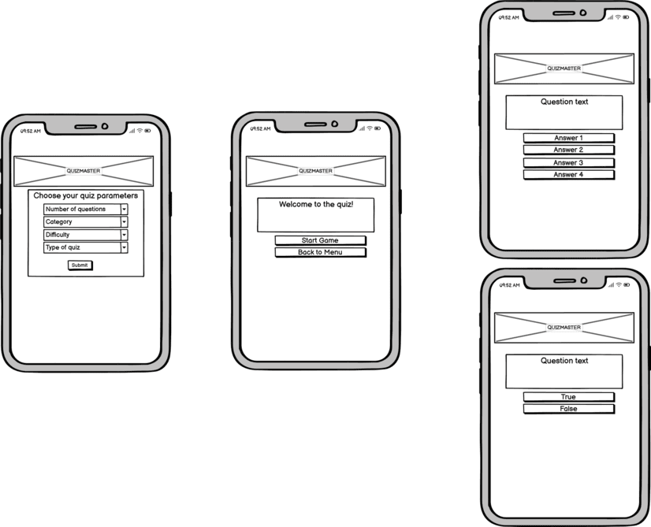
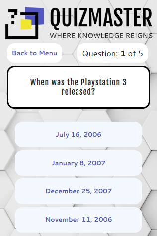
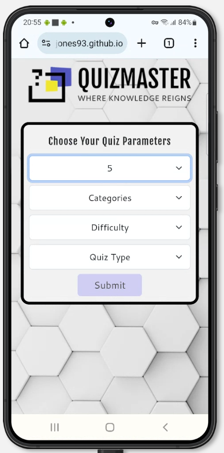
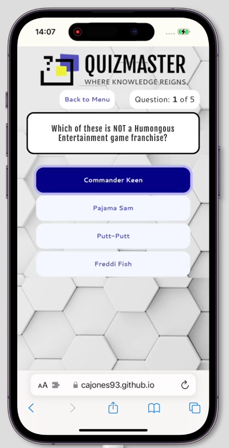
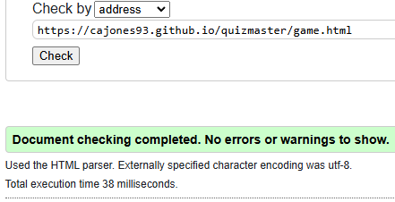

# Quizmaster

Link to the live site: [Quizmaster](https://cajones93.github.io/quizmaster/index.html)

## Table Of Contents:
1. [Justification](#justification)

2. [Design & Planning](#design-&-planning)
    * [User Stories](#user-stories)
      * [User](#user)
      * [Site Owner](#site-owner)
    * [Wireframes](#wireframes)
    * [Typography](#typography)
    * [Colour Scheme](#colour-scheme)
    
3. [Features](#features)
    * [Navigation](#Navigation)
    * [Home page](#Home-page)
    * [Game page](#game-page)
    * [Features left to implement](#features-left-to-implement)

4. [Technologies Used](#technologies-used)

5. [Testing](#testing)
  * [Googles lighthouse performance](#googles-lighthouse-performance)
  * [Browser compatibility](#browser-compatibility)
  * [Responsiveness](#responsiveness)
  * [Code Validation](#code-validation)
    * [HTML](#html-validation)
    * [CSS](#css-validation)
    * [JavaScript]()
  * [Manual testing](#manual-testing-user-stories-orand-features)

6. [Bugs](#bugs)

7. [Deployment](#deployment)

8. [Credits](#credits)

## Justification
The quizmaster app will allow users to choose their own quiz parameters including the category, number of questions, difficulty, and quiz format (multiple choice or true/false) so that users can personalise the content to their own preferences. This will increase user satisfaction and encourage users to keep using the app. Allowing users to customise the quiz experience means they can choose a topic they are interested in and compete with their friends. New topics and content can easily be added to the quiz by updating the API with new questions and categories.
Beyond this project, there are numerous other features that could be added such as tracking user interaction to enhance the overall user experience. High score tables and more in-depth scoring systems could also be implemented.

## Design & Planning:

### User Stories
#### User 
As a user, I want to be able to:

- select the quiz category so I can choose the topic I am interested in.
- choose the number of questions so I can adjust the length of the quiz.
- select the difficulty level so I can challenge myself or make the quiz more suitable to my knowledge level.
- choose between multiple quiz types to tailor the quiz to my own quiz preference.
- track my final score and percentage of correct answers to I can identify areas for improvement.
- return to the quiz menu after finishing so I can easily start a new quiz. 

#### Site Owner
As the site owner, I want to be able to:
- provide users with a customisable and engaging quiz so they are more likely to return to the site and use the application.
- easily add new categories and questions so the application can be updated regularly with new content.
- provide the user with a score that they can share with friends to challenge eachother and reach new users.

### Wireframes
Wireframes were created in Balsamiq.

#### Desktop

#### Mobile

### Typography
I searched for a suitable font pairing on [fontpair.co](https://www.fontpair.co/all). I chose Fjalla One for titles and question content and Cantarell for the answer buttons. These fonts are easy to read so are ideal for a quiz application.

### Colour Scheme
This is the colour scheme I used for this project. I found it on Adobe Color trends in the UI/UX section [Adobe Color trends](https://color.adobe.com/trends/Ui/ux). I wanted to stick with a limited color scheme that is not too distracting from the questions and answers.

## Features:

### Navigation
A user can navigate through the website through the buttons and forms. To get to the quiz, a user must input all of the quiz parameters and click the submit button. A user can return to the menu through the "back to menu" button. This button is on the game page and in the error and score modals that appear. After starting the quiz, a user can return to the menu any time by pushing the "back to menu" button above the question container.

### Index Page
The index page shows a quiz parameters form. A user must select all of the quiz parameters before they are able to submit the form. This ensures that they have chosen all settings before trying to start the quiz.

The submit button is disabled until a user selects all of the quiz parameters.

### Game Page - Loading Div
A loading "page" was added to prevent too many API calls in a short time which would lead to errors from the API. When loading the page for the first time,  refreshing the page, or refreshing the session token the user will see this div. It has a loading spinner as feedback for the user to know the site is still working and loading text so the user knows what is happening.

### Game Page - Start
The user will see an initial page layout which prompts them to start the game. The start game button will make the API call and set all of the quiz questions and answers. If there is an error, an error modal will appear. If not, the quiz answer buttons will change based on the quiz type selected.

### Game Page - Multiple Quiz
If the user has selected multiple choice for the quiz type, 4 buttons will be shown and answers will be randomly allocated to each button. If the user selects the correct answer, their score is increased and the next question is shown. If incorrect, the next question is shown. When the final question is answered, a score modal will appear.

### Game Page - Boolean Quiz
If the user has selected true/false for the quiz type, 2 buttons will be shown "true" and "false". If the user selects the correct answer, their score is increased and the next question is shown. If incorrect, the next question is shown. When the final question is answered, a score modal will appear.

### Session Token
The API provides a session token which prevents the API from showing a user the same question twice until the session token is refreshed. I decided to implement this to make things more interesting for the user. It is more interesting to answer different questions each time rather than answering the same questions over and over. This session token did cause a lot of issues during development which I have resolved.

### No Parameters Error Modal
If a user directly accesses the game page without setting quiz parameters in the index page, they will be shown an error modal directing them back to the menu to set their parameters.

### Token Error Modal
If the API returns a response code 4 error, this meant that the API had returned all of the available questions and the session token needed to be refreshed. I created an error modal that has a button to refresh the token. The refresh token button calls the session token refresh link from the API and refreshes the page. This should reset all of the questions and allow the user to play again.

### Score Modal
The score modal is shown at the end of the quiz. It shows the users score as a number and as a percentage. It also includes a back to menu button to return to the index page.

### Custom 404 Page
I created a simple custom 404 page that contains a link back to the index page.

### Features left to implement
* I wanted to add a high score table to track the users high scores for each quiz type but thought it would take too long to implement and would involve more APIs such as .
* I had to remove one of the difficulty levels because there weren't enough true/false questions in the API database for some categories. I tried to add my own questions to the API but I never received a verification email from them to create an account.
* It would be nice to have a different page layout available in portrait and landscape. I only focused on a portrait view but a user may want to rotate their phone or tablet to play in landscape.

## Technologies Used
* HTML - used for structuring the website
* CSS - for style and layout
* Bootstrap - for style and layout
* JavaScript - for interactivity
* Open Trivia Database - API for quiz questions and answers
* Google Fonts - for the fonts
* Github - for hosting and deploying the website
* BrowserStack - for testing the website compatibility with different browsers
* Responsinator - to view website on different devices
* Am I responsive? - to check responsive design
* Imageresizer - to resize images easily
* Cloud convert - to convert images to the webp format
* logo.com - to create an interesting logo
* Adobe color - to find a good colour scheme
* Pagespeed Insights - for Google lighthouse testing

## Testing
### Google's Lighthouse Performance
This section contains screenshots of the Index and Game page lighthouse scores.
Each page has a mobile and desktop score. 

#### Index page
#####  Mobile

##### Desktop

#### Game page
##### Mobile

##### Desktop

### Browser Compatibility
#### Chrome
##### Desktop

Result: No issues

##### Mobile

Result: No issues

#### Firefox
##### Desktop

Result: No issues

##### Mobile

Result: No issues

#### Safari
##### Desktop (Safari 5.1)

Result: Safari 5.1 on a Windows machine was unable to connect to the website.

##### Mac (Safari 18.1)

Result: No issues

##### Mobile

Result: No issues

### Responsiveness
This section shows the website responsiveness on a mobile device, iPad, and desktop. You can see how the site adapts to the different screen sizes through these screenshots.

#### Index Page
##### Mobile

##### iPad

##### Desktop

#### Game Page
##### Mobile

##### iPad

##### Desktop

### Code Validation
#### HTML Validation
##### Index page

Result: No Errors.

##### Game page

Result: No Errors.

#### CSS Validation
##### Index page

Result: No Errors.

##### Game page

Result: No Errors.

#### JavaScript Validation (JSHint)
##### Index.js

Result: No Errors.

##### Game.js

Result: One warning, one unused variable.

Notes: 
Warning related to adding eventListeners to buttons in a loop leading to confusing semantics. I thought this was a more concise way to add functionality to my answer buttons.
Unused variable relates to the refreshToken function which is called by a button in the error modal so is not unused.

### Manual Testing user stories or/and features
#### Testing for API calls, questions, answers, modals, and buttons
Test | Pass
--- | :---:
A user cannot submit the quiz parameters form without selecting all parameters  | &check;
A user can submit the quiz parameters form after selecting all parameters  | &check;
Quiz parameter variables are passed from the index page to the game page | &check;
The API returns questions and answers after clicking the start game button  | &check;
A user can return to the index page by pushing the back to home buttons | &check;
Choosing an answer moves onto the next question  | &check;
Questions and answers are assigned to the correct places  | &check;
Question and answer text is displayed correctly | &check;
The score modal is displayed after the final question is answered  | &check;
Back to Menu buttons on game page and in modals take the user back to the index page | &check;
If the API returns response code 4, the error modal is displayed | &check;
The session token is refreshed when the refresh token button is pressed | &check;
The loading div is displayed when the user goes to the game page | &check;
The loading div is displayed when a user refreshes the game page | &check;
The loading div is removed after 3 seconds on the game page | &check;
The quiz parameters still exist when the user refreshes the game page | &check;
If a user directly enters the game page without setting quiz parameters, they are shown an error | &check;

#### User Story Testing
Number | User Story |  Test | Pass
--- | --- | --- | :---:
1 | A user wants to select a quiz category so they can choose a topic they are interested in. | The user selects a category from the quiz parameters form on the index page | &check;
2 | A user wants to choose the number of questions so they can adjust the length of the quiz | The user chooses how many questions from the quiz parameters on the index page form | &check;  
3 | A user wants to select the difficulty level so they can challenge themselves. | The user selects their preferred difficulty from the quiz parameters form on the index page. | &check;
4 | A user wants to choose between multiple quiz types. | The user chooses their preferred quiz type from the quiz parameters form on the index page. | &check;
5 | A user wants to see their final score and percentage of correct answers. | The user completes the quiz and sees their score displayed on the screen. | &check;
6 | A user wants to return to the quiz menu after finishing the quiz so they can easily start a new quiz. | The user clicks the back to menu button on the score screen. | &check;

##### User stories testing screenshots
###### 1. Select a quiz category

###### 2. Choose the number of questions

###### 3. Select a difficulty level

###### 4. Choose between multiple quiz types

###### 5. See their final score

###### 6. Return to the quiz menu after quiz

## Bugs

> Questions and answers were showing with HTML encoded characters
**Resolved** - Changed innerText to innerHTML to fix issues.

> Kept getting "TypeError: Cannot read properties of undefined (reading 'question')".
**Resolved** - accidentally undefined questionNo while cleaning up code, resetting questionNo to 0 fixed the bug.

> If a user refreshed the quiz, they would get an API error for too many API calls in a short time.
**Resolved** -  Added a 3 second loading div on page load to prevent this

> If a user generates a large quiz, then refreshes the page response code 4 is generated by the API because there are not enough questions.
**Resolved** - Added a modal that prompts the user to refresh the token or return to the main menu to change quiz parameters

> Used setInterval and clearInterval for the loading screen but it kept repeating itself.
**Resolved** - Replaced setInterval with setTimeout to only perform the action once as intended.

> Not enough true/false questions in the API for some categories.
**Resolved** - Tried to sign up to add my own questions but validation email was never received. Decided to remove the hard difficulty option. "Hard" in the difficulty choices now selects "medium" from the API.

## Deployment
#### Creating Repository on GitHub
- First make sure you are signed into [Github](https://github.com/) and go to the code institutes template, which can be found [here](https://github.com/Code-Institute-Org/gitpod-full-template).
- Then click on **use this template** and select **Create a new repository** from the drop-down. Enter the name for the repository and click **Create repository from template**.
- Once the repository was created, I clicked the green **gitpod** button to create a workspace in gitpod so that I could write the code for the site.

#### Deloying on Github
The project was deployed using GitHub pages. The steps to deploy using GitHub pages are:

1. Go to the repository on [Github](https://github.com/)
2. Select **Settings** near the top of the page.
3. Select **Pages** from the menu bar on the left of the page.
4. Under **Source** select the 'Branch' dropdown menu and select the main branch.
5. Once selected, click the **Save**.
6. Deployment should be confirmed by a message saying "Your site is published at" followed by the web address.

## Credits
### Code & Text Content
  
  > To fix local storage issues - Juan Fernández Sagasti: [Link](https://coderwall.com/p/ewxn9g/storing-and-retrieving-objects-with-localstorage-html5)

  > To fix encoding bug - Dr. Dwight McClure: [Link](https://www.quora.com/How-do-you-change-the-text-of-a-button-using-inner-HTML)

  > Durstenfeld shuffle algorithm - webbower: [Link](https://gist.github.com/webbower/8d19b714ded3ec53d1d7ed32b79fdbac)

  > Making API calls - Anna Fitzgerald: [Link](https://blog.hubspot.com/website/api-calls)
  
  > Simple countdown for loading div - James McDowell: [Link](https://stackoverflow.com/questions/31106189/create-a-simple-10-second-countdown)
  
  > Quiz questions and answers - Open Trivia Database: [Link](https://opentdb.com/)

### Media
  
> Background Image - pikisuperstar: [Link](https://www.freepik.com/free-photo/hex-background-networking_66468511.htm#fromView=search&page=1&position=0&uuid=a21d2bad-19c4-4ccc-9d89-9aad5b09cfca)

> Answer Buttons CSS - Mhyar-nsi: [Link](https://uiverse.io/Mhyar-nsi/tiny-wasp-99)

> 404 page shocked cartoon image -  Ladixstudio: [Link](https://www.creativefabrica.com/product/kawaii-cartoon-character-cute-shocked/)
### Acknowledgment
> Thank you to course facilitator Marko for providing a lot of useful information and weekly standup calls.